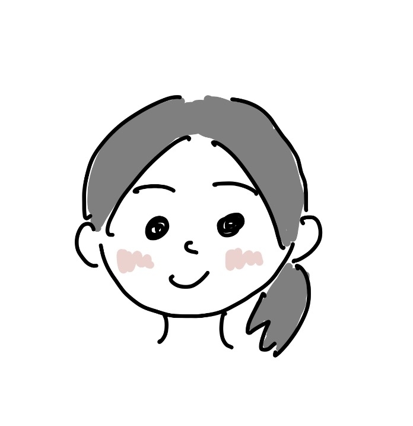

```{=html}
<style>

html,body{
    margin:0;
    padding:0;
    width:100%;
    background:#f4f4f4;
    font-family:Arial,sans-serif;
}

/* R Markdown の余白を削除 */
.main-container{
    max-width:100% !important;
    width:100% !important;
    margin:0 !important;
    padding:0 !important;
}

/* ヘッダー */
header{
    width:100%;
    background:#003366;
    color:white;
    text-align:center;
    padding:50px 20px;
    box-sizing:border-box;
}

header h1{
    margin:0;
    font-size:48px;
}

header p{
    margin-top:10px;
    font-size:22px;
}

/* メニュー */
nav{
    background:#00509e;
    display:flex;
    justify-content:center;
    flex-wrap:wrap;
}

nav a{
    color:white;
    text-decoration:none;
    padding:16px 25px;
    font-weight:bold;
}

nav a:hover{
    background:#003366;
}

/* 本文 */
.container{
    width:90%;
    max-width:1200px;
    margin:40px auto;
}

.card{
    background:white;
    padding:30px;
    margin-bottom:30px;
    border-radius:12px;
    box-shadow:0 4px 12px rgba(0,0,0,.15);
}

.card h2{
    margin-top:0;
}

nav a.active{
    background:#f4f4f4;
    color:#003366;
    font-weight:bold;
    border-radius:5px;
}

/* フッター */
footer{
    background:#003366;
    color:white;
    text-align:center;
    padding:15px;
}

/* スマホ対応 */
@media(max-width:768px){

header h1{
    font-size:32px;
}

header p{
    font-size:17px;
}

nav{
    flex-direction:column;
}

nav a{
    text-align:center;
    border-top:1px solid rgba(255,255,255,.2);
}

.container{
    width:95%;
}

}

</style>

<header>

<h1>鷹取研究室</h1>

<p>Wireless Communications & ISAC Laboratory</p>

</header>
<nav>
<a href="index.html">Home</a>
<a href="research.html">研究紹介</a>
<a href="members.html" class="active">メンバー</a>
<a href="equipment.html">研究設備</a>
<a href="publications.html">研究実績</a>
<a href="contact.html">Contact</a>
</nav>

<div class="container">

<h1 style="text-align:center;">研究室メンバー</h1>
<div class="member-grid">

<fieldset>
  <legend><h2>修士1年</h2></legend>
  
<div class="member-card">
<h3>名前(ニックネームでも可)</h3>

<p>
<b>趣味</b><br>
ドラム、植物鑑賞
</p>

<p>
<b>一言</b><br>
最近はサボテンを育てています！
</p>
</div>

<br><br>


<div class="member-card">
<h3>名前くん</h3>

<p>
<b>趣味</b><br>
○○
</p>

<p>
<b>一言</b><br>
○○
</p>
</div>
</fieldset>

<fieldset>
  <legend><h2>大学４年</h2></legend>
<div class="member-card">
<h3>名前さん</h3>

<p>
<b>趣味</b><br>
○○
</p>

<p>
<b>一言</b><br>
○○
</p>
</div>
<br><br>

<div class="member-card">
<h3>名前ちゃん</h3>

<p>
<b>趣味</b><br>
○○
</p>

<p>
<b>一言</b><br>
○○
</p>
</div>
</fieldset>

</div>

</div>


<footer>

© 2026 Takatori Laboratory

</footer>
```